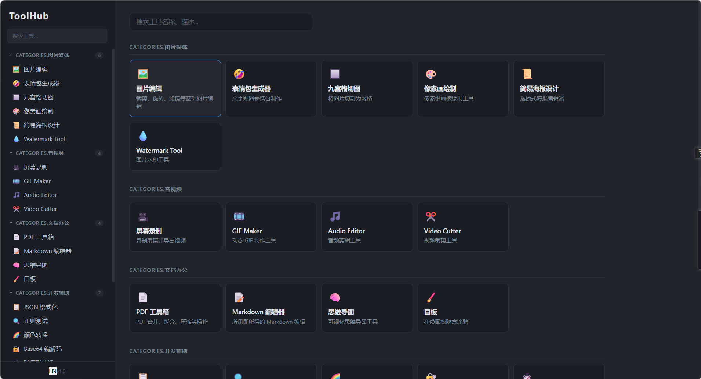
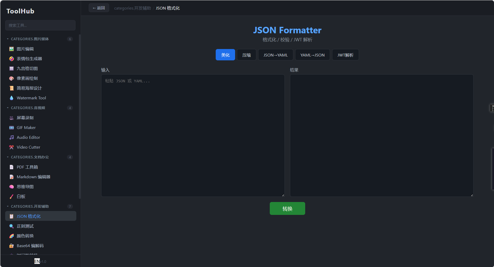
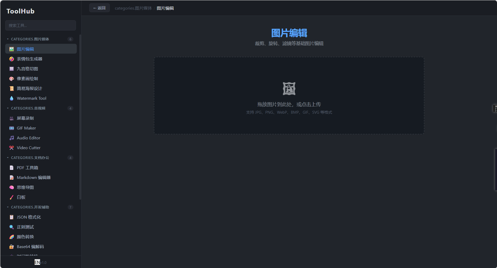
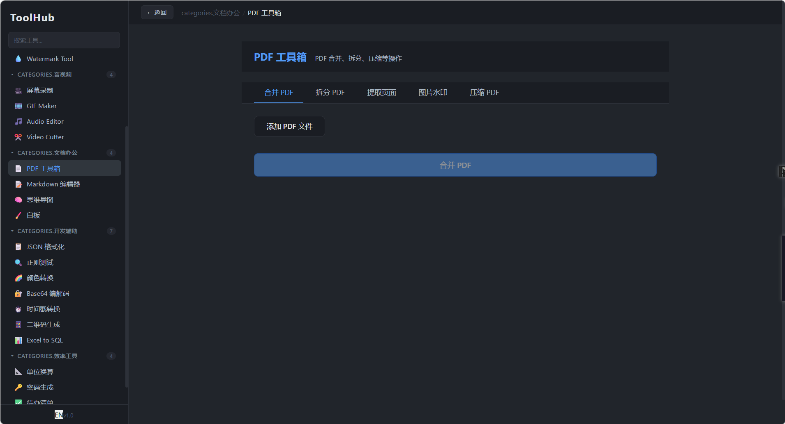
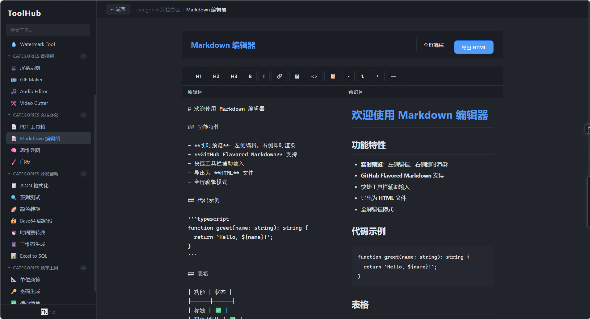
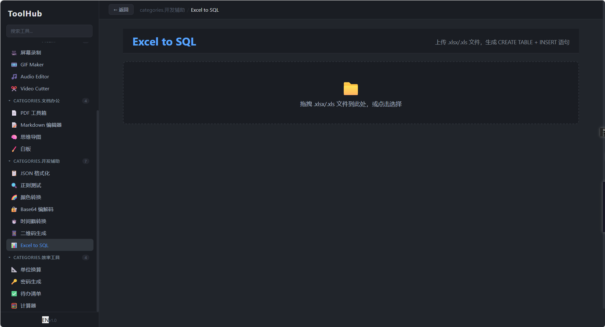

```
  _______          _   _       _     
 |__   __|        | | | |     | |    
    | | ___   ___ | | | |_   _| |__  
    | |/ _ \ / _ \| | | | | | | '_ \ 
    | | (_) | (_) | |_| | |_| | |_) |
    |_|\___/ \___/ \___/ \__,_|_.__/ 
                                      
  All-in-One Developer Toolkit · 25+ Tools · Web + Desktop
```

---

<p align="center">
  
  
  
  
  
  
</p>

<p align="center">
  <b>A local desktop / web dual-platform toolbox with 25+ practical tools</b><br/>
  <sub>Pure frontend · Data stays local · Ready out of the box</sub>
</p>

<p align="center">
  <a href="README.md">中文</a> &nbsp;|&nbsp; <a href="README_EN.md"><b>English</b></a>
</p>

---

## ✨ Features

|     |     |
| --- | --- |
| 🚀 **25+ Tools** | Covers JSON, Images, Audio/Video, Documents, Encoding, and Developer Tools |
| 🖥️ **Web + Desktop** | One codebase, browser access + Electron desktop app |
| 🌙 **Dark Business Theme** | Built-in dark mode, eye-friendly and professional |
| ⚡ **Pure Frontend** | All tools run locally in browser, data never leaves your machine |
| 📦 **One-Click Build** | `npm run build` to produce deliverables, zero config |
| 🌍 **i18n Support** | Built-in i18n, seamless Chinese / English switching |

---

## 🧰 Tool Matrix

### 📝 JSON & Data

| Icon | Tool | Description |
|:---:|------|------|
| 🔍 | JSON Formatter | One-click beautify / minify JSON with syntax highlighting + error locator |
| 🌳 | JSON to Tree | Visualize flat JSON data as a tree structure |
| 🔄 | JSON ↔ XML | Convert between JSON and XML formats |
| 📋 | JSON ↔ YAML | Convert between JSON and YAML config files |
| 🧾 | JSON to CSV | Export JSON arrays as CSV spreadsheet data |
| 📊 | Mock Data Generator | Quickly generate random mock data with custom rules |

### 🖼️ Image Processing

| Icon | Tool | Description |
|:---:|------|------|
| ✂️ | Image Cropper | Free crop / fixed ratio crop with live preview |
| 🎨 | Image Editor | Add text, filters, stickers, doodles |
| 🔄 | Format Converter | JPG ⇄ PNG ⇄ WebP ⇄ SVG conversion |
| 📐 | Compress & Resize | Batch compress images, custom width/height and quality |
| 🏷️ | Watermark | Text / image watermark, batch processing |
| 🎨 | Color Picker | Screen color picker, palette generator, color code output |

### 🎵 Audio & Video

| Icon | Tool | Description |
|:---:|------|------|
| 🎙️ | Audio Player | Waveform visualization playback, MP3 / WAV / OGG support |
| ✂️ | Audio Trimmer | Precisely trim audio clips, export as MP3 |
| 🎬 | Video Player | Local video playback with screenshot and speed control |

### 📄 Documents & Office

| Icon | Tool | Description |
|:---:|------|------|
| 📑 | PDF Merge & Split | Merge multiple PDFs or split specific pages |
| 🖊️ | PDF Annotator | Highlight, underline, comments, signatures |
| 📊 | Excel Viewer | Browse and filter Excel spreadsheets online |
| 🔤 | Markdown Editor | Real-time Markdown preview, export to HTML/PDF |

### 🔐 Encoding & Encryption

| Icon | Tool | Description |
|:---:|------|------|
| 🔑 | Base64 Codec | Text / image Base64 encoding and decoding |
| 🔒 | Hash Calculator | MD5 / SHA1 / SHA256 one-click computation |
| 📟 | Unicode / URL Codec | Quick escape character encoding/decoding |
| 🧩 | Regex Tester | Real-time regex matching and highlighting |

### 🛠️ Developer Tools

| Icon | Tool | Description |
|:---:|------|------|
| ⏱️ | Timestamp Converter | Unix timestamp ↔ date/time conversion |
| 🎨 | Color Converter | HEX ↔ RGB ↔ HSL real-time conversion |
| 📏 | Unit Converter | Pixel / REM / EM / cm CSS unit conversion |
| 🔤 | Text Diff | Side-by-side diff view, highlight additions and deletions |

---

## 📦 Installation

```bash
# Clone the repository
git clone https://github.com/your-org/tool-hub.git
cd tool-hub

# Web development mode
npm install && npm start

# Desktop development mode (Electron)
npm run electron:dev

# Build desktop application
npm run build && npx electron-builder
```

---

## 📸 Screenshots

| Home | JSON Formatter | Image Editor |
|:---:|:---:|:---:|
|  |  |  |

| PDF Toolbox | Markdown Editor | Excel to SQL |
|:---:|:---:|:---:|
|  |  |  |

---

## 🎥 Demo

<!-- Replace with actual screen recording -->
<p align="center">
  
</p>

---

## 🏗️ Tech Stack

| Layer | Technology |
|------|-------------|
| Framework | **React 18** + **TypeScript** |
| Bundler | **Vite** |
| Desktop | **Electron 28** |
| i18n | **i18next** |
| Graphics | **Canvas API** |
| Documents | **pdf-lib** · **SheetJS** |
| Audio | **wavesurfer.js** |
| Styling | CSS Modules + Custom dark theme |

---

## 📂 Project Structure

```
tool-hub/
├── src/
│   ├── tools/              # 25 tool components organized by category
│   │   ├── json/           # JSON & Data
│   │   ├── image/          # Image Processing
│   │   ├── media/          # Audio & Video
│   │   ├── document/       # Documents & Office
│   │   ├── encode/         # Encoding & Encryption
│   │   └── devtools/       # Developer Tools
│   ├── components/         # Shared components (Sidebar, HomePage, ToolCard)
│   ├── i18n/               # i18n config and locale files
│   ├── electron/           # Electron main process and preload scripts
│   ├── styles/             # Global styles and theme variables
│   ├── hooks/              # Custom hooks
│   └── utils/              # Utility functions
├── public/                 # Static assets
├── screenshots/            # Screenshots
├── demos/                  # Demo GIFs
├── electron-builder.yml    # Electron packager config
├── package.json
├── tsconfig.json
├── vite.config.ts
└── README.md
```

---

## 🤝 Contributing

Issues and PRs are welcome!

1. **Fork** this repository
2. Create a feature branch: `git checkout -b feat/amazing-tool`
3. Commit your changes: `git commit -m 'feat: add amazing tool'`
4. Push to the branch: `git push origin feat/amazing-tool`
5. Submit a **Pull Request**

> Please open an Issue first to discuss your ideas and avoid duplicated effort.

---

## 📄 License

This project is open source under the [MIT License](LICENSE). Free to use, modify, and distribute.

---

<p align="center">
  <sub>Made with ❤️ by ToolHub Team · 2026</sub>
</p>